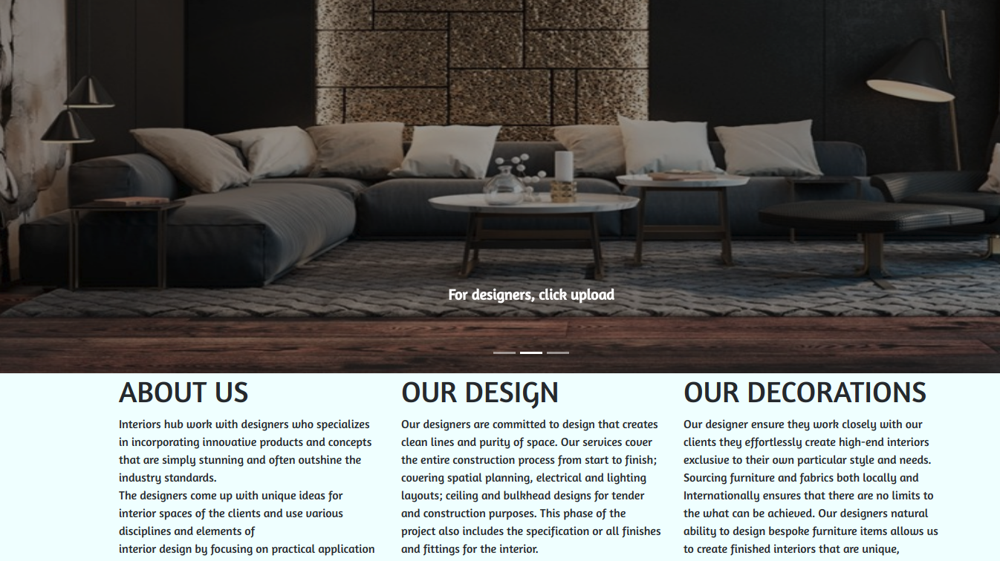
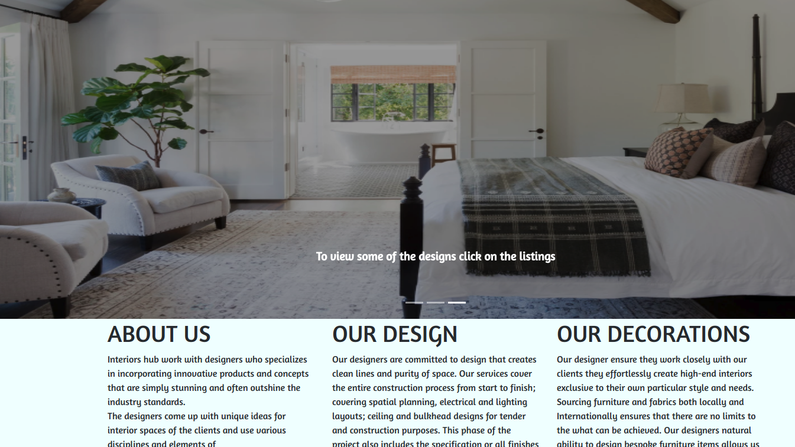

# INTERIORS HUB
#### This is a Website where interiors designers upload their works and viewers are able to view at one central point and get to choose and contact the best designers.
##### By **Margaret254,Njoroge33,marysinaida,ibrahnerd7**&trade;

## Description
Interiors hub work with designers who specializes in incorporating innovative products and concepts that are simply stunning and often outshine the industry standards.
Viewers are given the chance to choose among the best designer and contact them if they need their services.
## Project live site
  This is the live link .[ https://github.com/margaret254/pizza ]()

  
  

## Setup instructions
* Clone the program from [Online repo]()
* Click on the green button to clone or download
* open your terminal 
* cd into Documents/interiors-hub
* open with your favourite text editor, for vs code,code . or atom . for atom.

## Behavior Driven Development
<table>
    <tr>
      <th>Behavior</th> 
      <th>Input</th> 
      <th>Output</th>   
    </tr>
    <tr>
        <td>on load</td>
        <td>scroll and see different types of designs that has been uploaded </td>
        <td>look at the ones you like</td>
    </tr>
     <tr>
        <td>Upload Dropdown</td>
        <td>click on Upload if you are a deisigner to upload your works and if you are a viewer,pick the contacts information to contact your desired designer</td>
        <td>on Save button you will see your work being uploaded if you are the designer.</td>
    </tr> 
    <tr>
        <td>Enter your Name, Email,Phone Number and Subject if you want to leave a message</td>
        <td>[Serah], [maggiemwas34@gmail.com], [0790456789],[hello,]</td>
        <td>Output; = Serah,maggiemwas34@gmail.com,0790456789,hello.</td>
    </tr>
    <tr>
        <td>Enter Email </td>
        <td>['Email':'msggiemwas34@gmail.com'</td>
        <td>Email</td>
    </tr>
    <tr>
        <td>Enter Phone Number</td>
        <td>[PhoneNumber:'0790456789']</td>
        <td>PhoneNumber</td>
    </tr>
    <tr>
        <td>Subject</td>
        <td> Message</td>
        <td>Hi Serah we have received your message and we will get in touch. Thank you for contacting us</td>
    </tr>
       
</table>

## Technologies Used
* HTML-For Building Mark Up pages
* CSS-For styling User Interface
* Bootsrap-For making webpage responsive
* JQuery-For animations and cool effects of the website like hiding and showing elements
* Javascript-For DOM(Document Object Manipulation)scripts
* Firebase DataBase for Storing Data

## Support and contact details
Contact us  at https://github.com/ibrahnerd7/interiorsHub/issues .
### License

MIT License

Copyright (c) 2019 

Permission is hereby granted, free of charge, to any person obtaining a copy
of this software and associated documentation files (the "Software"), to deal
in the Software without restriction, including without limitation the rights
to use, copy, modify, merge, publish, distribute, sublicense, and/or sell
copies of the Software, and to permit persons to whom the Software is
furnished to do so, subject to the following conditions:

The above copyright notice and this permission notice shall be included in all
copies or substantial portions of the Software.

THE SOFTWARE IS PROVIDED "AS IS", WITHOUT WARRANTY OF ANY KIND, EXPRESS OR
IMPLIED, INCLUDING BUT NOT LIMITED TO THE WARRANTIES OF MERCHANTABILITY,
FITNESS FOR A PARTICULAR PURPOSE AND NONINFRINGEMENT. IN NO EVENT SHALL THE
AUTHORS OR COPYRIGHT HOLDERS BE LIABLE FOR ANY CLAIM, DAMAGES OR OTHER
LIABILITY, WHETHER IN AN ACTION OF CONTRACT, TORT OR OTHERWISE, ARISING FROM,
OUT OF OR IN CONNECTION WITH THE SOFTWARE OR THE USE OR OTHER DEALINGS IN THE
SOFTWARE.

Copyright (c) 2019 